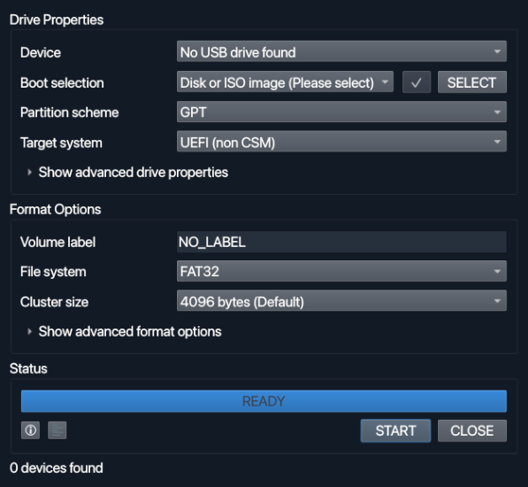

<p align="center">
  
</p>

<h1 align="center">Rufux</h1>

<p align="center">
  Make bootable USB sticks on Linux, the way Rufus does on Windows.
</p>

<p align="center">
  <a href="https://github.com/Hultwl/Rufux/releases/latest"></a>
  <a href="https://github.com/Hultwl/Rufux/actions/workflows/rufux.yml"></a>
  <a href="https://aur.archlinux.org/packages/rufux-git"></a>
  <a href="https://github.com/Hultwl/Rufux/blob/main/LICENSE.txt"></a>
  
</p>

<p align="center">
  <a href="https://github.com/Hultwl/Rufux/releases/latest/download/Rufux-x86_64.AppImage"><strong>⬇ Download AppImage</strong></a>
</p>

<p align="center">
  
</p>

---

Rufux is a port of [Rufus](https://github.com/pbatard/rufus) to Linux. It does
the same job: pick a drive, pick an ISO, press START. I wrote it because I
kept wanting Rufus on my Linux machine and `dd` was not enough for Windows
install media.

The window is a copy of Rufus's main window (same sections, same wording),
drawn with your desktop's own widget style and file dialogs.

## What it does

- **Disk or ISO image.** Write an image in DD mode, or in ISO mode (partition,
  format, copy the files, make it bootable). Like Rufus, it asks which mode to
  use when an image is an ISOHybrid.
- **Windows install media.** NTFS with a small UEFI:NTFS partition (any image
  size), or FAT32 (Secure Boot friendly, `install.wim` is split when it is
  over 4 GiB). GPT or MBR. The "Windows User Experience" options are the ones
  Rufus has: skip the RAM/Secure Boot/TPM checks, skip the online account,
  create a local account, copy your regional options, skip the privacy
  questions, no BitLocker auto-encryption, and the QoL tweaks.
- **FreeDOS** sticks, **non bootable** drives, persistence for Linux live
  images, bad-block checks, checksums (MD5, SHA-1, SHA-256, SHA-512).
- **Safety.** The command line only prints a plan unless you pass
  `--real --yes` and run as root. Fixed disks are hidden unless you tick
  "List USB Hard Drives".

## Limits

- Windows sticks made with NTFS boot on UEFI machines only. Legacy BIOS boot
  from NTFS needs a boot loader that Linux formatting tools do not write.
- FAT32 Windows sticks also have no legacy BIOS boot code yet.
- Not there: ReFS, downloading Windows ISOs, Windows To Go, the language
  button. See [PORTING.md](PORTING.md).

## Install

**AppImage:** get it from the
[latest release](https://github.com/Hultwl/Rufux/releases/latest), then
`chmod +x Rufux-x86_64.AppImage` and run it.

**Arch:** `paru -S rufux-git`

**From source:**

```sh
cmake -B build -DCMAKE_BUILD_TYPE=Release
cmake --build build
ctest --test-dir build
sudo cmake --install build
```

Build needs Qt6 (Widgets, Concurrent), OpenSSL and CMake. At run time it uses
`dosfstools`, `ntfs-3g`, `exfatprogs`, `e2fsprogs`, `util-linux`, `udisks2`,
`polkit` and `p7zip`. For the Windows 11 checks bypass and FAT32 with a large
`install.wim` you also want `wimlib` and `hivex`. Package names per
distribution are in [packaging/README.md](packaging/README.md). Some tests skip
themselves when a tool or root access is missing.

## Command line

```sh
rufux list                                    # removable drives
rufux probe image.iso --detail                # label, size, bootable?
rufux write image.iso /dev/sdX --dry-run      # show the plan
sudo rufux write image.iso /dev/sdX --real --verify --yes

# Windows install media (GPT, NTFS, skip the hardware checks):
sudo rufux create Win11.iso /dev/sdX --mode windows --wue bypass --real --yes

# FAT32 instead, with a local account:
sudo rufux create Win11.iso /dev/sdX --mode windows --fs vfat \
     --wue bypass,nro,user=Sam --real --yes

rufux --gui [image.iso]                       # the window
```

Run `rufux` with no arguments for every option, or `man rufux`.

## More

- [PORTING.md](PORTING.md): what comes from Rufus and what is different
- [CHANGELOG.md](CHANGELOG.md)
- [docs/TODO.md](docs/TODO.md)
- [tests/HW_MATRIX.md](tests/HW_MATRIX.md): what I have tried on real drives

Bug reports help most with the log attached (Log button, then Save).

## Credits and license

Port of [pbatard/rufus](https://github.com/pbatard/rufus) by Pete Batard.
GPLv3, like upstream. It used to be called Lufus; I renamed it to avoid
confusion with [Hogjects/Lufus](https://github.com/Hogjects/Lufus), which is
an unrelated project.
